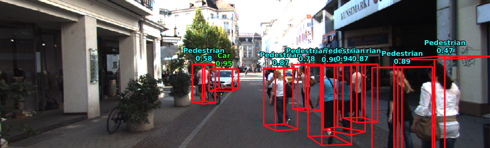
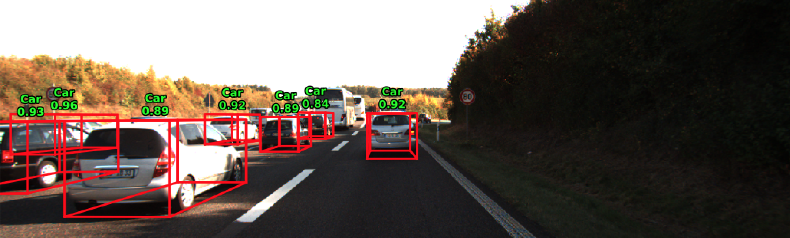

# PointRCNN
Warning: This is **not** the official implementation of PointRCNN, and it is still in progress.
## Introduction
A 3D object detector that takes point cloud and RGB image(optional) as input.  

## Architecture
1. Perform foreground point segmentation on the whole point cloud
2. Output a 3D proposal box for every foreground point
3. Crop point cloud with proposal boxes and feed into the 2nd-stage classification and box refinement network


## Usage
### Dependencies
+ python2.7
+ tensorflow(1.10.0)
+ shapely
+ mayavi
+ opencv-python
+ Compile tensorflow operators for pointnet following to https://github.com/charlesq34/frustum-pointnets

### Data Preparation
For trainning and validation, download KITTI 3d object detection dataset, and put the folders as

```
dataset/KITTI/object/
  training/
    calib/
    image_2/
    label_2/
    velodyne/

  testing/
    calib/
    image_2/
    velodyne/
```

For testing, download KITTI video sequence and calibration files, and put the folders as

```
2011_10_03/
  calib_cam_to_cam.txt
  calib_imu_to_velo.txt
  calib_velo_to_cam.txt
  image_02/
  velodyne_points/
```

### Train
There are 3 sub-model to be trained.

**Region Proposal Network**

`python train/train_rpn.py --gpu 0 --decay_step 30000 --decay_rate 0.8 --batch_size=4 --learning_rate 0.002 --log_dir log_rpn --num_point 16384`

**Frustum Pointnet**

Before training the 2-Stage Network, we need to save the output of RPN and Image Segmentaion Network to the disk first. 

**Image Segmentation Network**

For now deeplabv3+ is used and finetune on KITTI 3D object dataset

### Evaluate

**Region Proposal Network**
`python test/test_rpn.py --gpu 0 --batch_size=1 --model_path ${RPN_MODEL_PATH} --img_model_path ${IMG_MODEL_PATH} --split train --kitti_path ${KITTI_DATA_PATH}`
This will save the output of RPN and Image segmentation network to `./rcnn_data_train` for training the RCNN network.

**Frustum Pointnet**

```
python train/test_frustum.py --gpu 0 --model_path log_frustum/model.ckpt --output val_results --num_point 512 --batch_size 12 --dump_result --kitti_path ./Kitti/object --split val
evaluate_object_3d_offline ./Kitti/object/training/label_2/ val_results
```

### Test

**End to end**

```
IMG_MODEL="./frozen_inference_graph.pb"
RPN_MODEL="log_rpn/model.ckpt"
RCNN_MODEL="log_frustum/model.ckpt"
python test/detect.py --gpu 0 --rpn_model ${RPN_MODEL} --img_seg_model ${IMG_MODEL} --rcnn_model ${RCNN_MODEL} --split test --kitti_path ./Kitti/2011_10_03 --output test_result_2011_10_03
```

## Evaluation
### Recall of RPN
|    Method  | Avg. Recall(IOU>0.5)|
| ---------- | ------------------- |
| Point Only |                 81% |
| Point+Image|                 86% |

### mAP on Val Set

|    Class   | 3D mAP(Easy, Moderate, Hard)  | BEV mAP(Easy, Moderate, Hard)  |
| ---------- | ----------------------------- |--------------------------------|
| Car        | 70.186958 63.863361 63.612400 |87.072685 78.929276 78.646278|
| Pedestrain | 51.292336 44.874256 37.747238 |63.765102 56.358772 48.899441|
| Cyclist    | 61.176849 42.489197 42.025532 |69.161484 42.851925 42.492092|


## Results




## Reference
- [Frustum PointNets for 3D Object Detection from RGB-D Data](https://arxiv.org/abs/1711.08488)
- [PointRCNN: 3D Object Proposal Generation and Detection from Point Cloud](https://arxiv.org/abs/1812.04244)