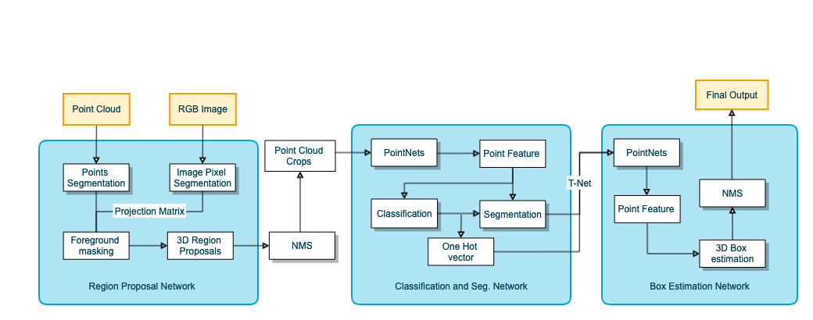

# PointRCNN
This is **not** the official implementation of PointRCNN. We add an image segmentation network to improve recall of point cloud segmentation. The 2-stage network is frustum pointNet. Any pull request is appreciated.
## Introduction
A 3D object detector that takes point cloud and RGB image(optional) as input.  

## Results
[](https://youtu.be/T-LzoQpt2N4)
[](https://youtu.be/CVSs2cEkKgk)

## Architecture
1. Perform foreground point segmentation on the whole point cloud
2. Output a 3D proposal box for every foreground point
3. Crop point cloud with proposal boxes and feed into the 2nd-stage classification and box refinement network


## Usage
### Dependencies
+ python2.7
+ tensorflow(1.10.0)
+ shapely
+ mayavi
+ opencv-python
+ Compile tensorflow operators for pointnet following to https://github.com/charlesq34/frustum-pointnets

### Data Preparation
For trainning and validation, download KITTI 3d object detection dataset, and put the folders as

```
dataset/KITTI/object/
  training/
    calib/
    image_2/
    label_2/
    velodyne/

  testing/
    calib/
    image_2/
    velodyne/
```

For testing, download KITTI video sequence and calibration files, and put the folders as

```
2011_10_03/
  calib_cam_to_cam.txt
  calib_imu_to_velo.txt
  calib_velo_to_cam.txt
  image_02/
  velodyne_points/
```

**[Optional] Scene Augmentation**

Our implementation also supports using augmented scene point cloud for training RPN, please refer to the official implementation of [PointRCNN](https://github.com/sshaoshuai/PointRCNN). After generating the data, just put the `aug_scene/` folder under `dataset/KITTI/object`. If you don't want to use it, just set `use_aug_scene=False` when using `rpn_dataset`. 

**Image segmentaion annotation**

Our image segmentation network is DeelabV3+ official implementation. The senmantic segmentation annotation is obtained by the following steps:
+ Pointcloud completion using [ip_basic](https://github.com/kujason/ip_basic)
+ Project 3D points to image plane to get segmentation annotation
Codes for finetuning can be founded at [deeplab_kitti_object](https://github.com/JenningsL/deeplab_kitti_object). Or you can just use your own image segmentation network.

### Train
There are 3 sub-model to be trained.

**Region Proposal Network**

```
sh train_rpn.sh
```

**Frustum Pointnet**

Before training the 2-Stage Network, we need to save the output of RPN and Image Segmentaion Network to the disk first. 

**Image Segmentation Network**

For now deeplabv3+ is used and finetune on KITTI 3D object dataset

### Evaluate

**Region Proposal Network**

```
sh test_rpn.sh
```

This will save the output of RPN and Image segmentation network to `./rcnn_data_train` for training the RCNN network.

**Frustum Pointnet**

```
test_frustum.sh
```

### Test

**End to end**

```
sh test.sh
```

## Evaluation
### Point cloud segmentation
|    Method  | Coverage | Recall | Precision |
| ---------- | -------- | ------ | --------- |
| Point Only | 89.7%    | 93.4%  | 82.2%     |
| Point+Image| 93.5%    | 97.0%  | 76.6%     |

Coverage means the percentage of object that have at least one point being detected.

### Recall of RPN
Setting: IoU >= 0.5, 100 proposal

|    Method  | 3 Classes Recall    | Car moderate | Pedastrian Moderate | Cyclist Moderate |
| ---------- | ------------------- | ------------ | ------------------- | ---------------- |
| Point+Image|                 89% | 96%          | 77%                 | 52%              |

### AP on Val Set

|    Class   | 3D mAP(Easy, Moderate, Hard)  | BEV mAP(Easy, Moderate, Hard)  |
| ---------- | ----------------------------- |--------------------------------|
| Car        | 76.56 70.20 64.00 | 86.32 78.42 78.07 |
| Pedestrain | 70.23 63.09 55.77 | 73.34 65.86 57.94 |
| Cyclist    | 76.89 50.91 50.28 | 78.27 59.00 51.63 |

## Pretrained Models

| Model | Link |
| ----- | ---- |
| RPN |[log_rpn.zip](https://drive.google.com/open?id=1xeBRkwGeF55O41_aht_ROB3wcwnCThHU)| 
| Image SegNet |[log_rpn.zip](https://drive.google.com/open?id=1LhR5p1klFX36IV0hAb54q66pOIsWfTNw)| 
| Frustum PointNet |[log_frustum.zip](https://drive.google.com/open?id=1K5cUgxwLvEDOKDkuYMbYPLa3FGbxGKr3)| 

## Reference
- [Frustum PointNets for 3D Object Detection from RGB-D Data](https://arxiv.org/abs/1711.08488)
- [PointRCNN: 3D Object Proposal Generation and Detection from Point Cloud](https://arxiv.org/abs/1812.04244)
